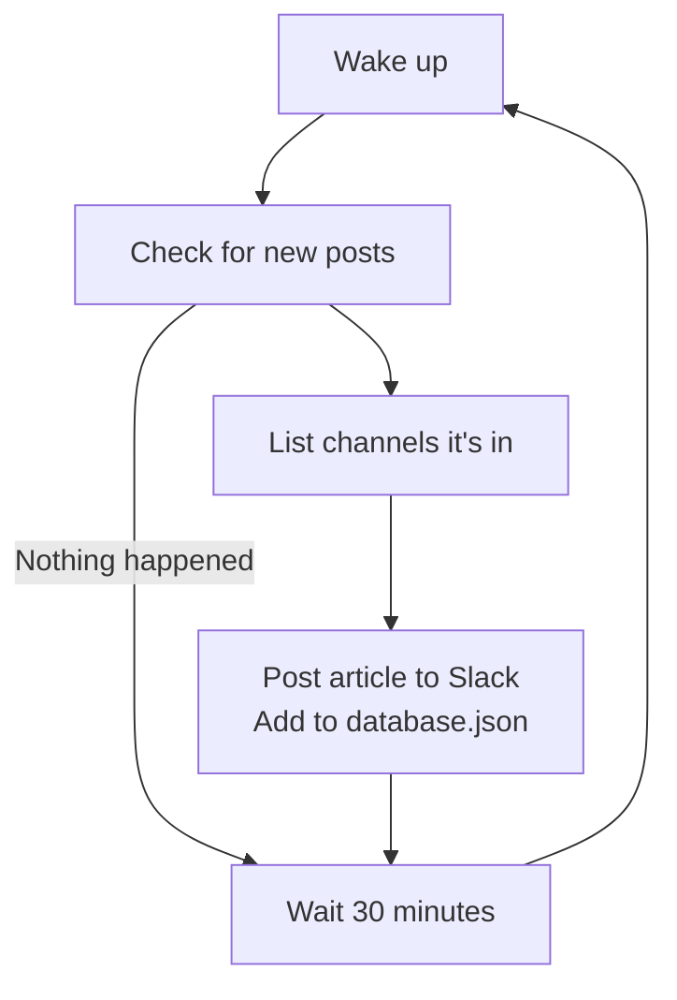

# Slacker News RSS

Small program to send to Slack channels when a new [HackClub News](https://news.hackclub.com) post comes out

## How it work

<!-- fancy ass diagram that took too long for what it's worth -->


## Installation

After installing the Docker compose and environment variable, make sure the bot isn't in any channels to don't bomb your channels with 10**67 messages (as the database is empty)

### docker-compose.yml

```yaml
services:
  slacker-news-rss:
    build: .
    restart: unless-stopped
    container_name: slacker-news-rss
    env_file:
      - .env
    environment:
      DATABASE_PATH: /data/database.json
      INTERVAL_SECONDS: 1800
    volumes:
      - ./data:/data
```

### Environment variable

```toml
RSS_FEED="https://news.hackclub.com/feed.xml"
SLACK_BOT_TOKEN="xoxb-_____"
SLACK_APP_TOKEN="xapp-_____"
```
