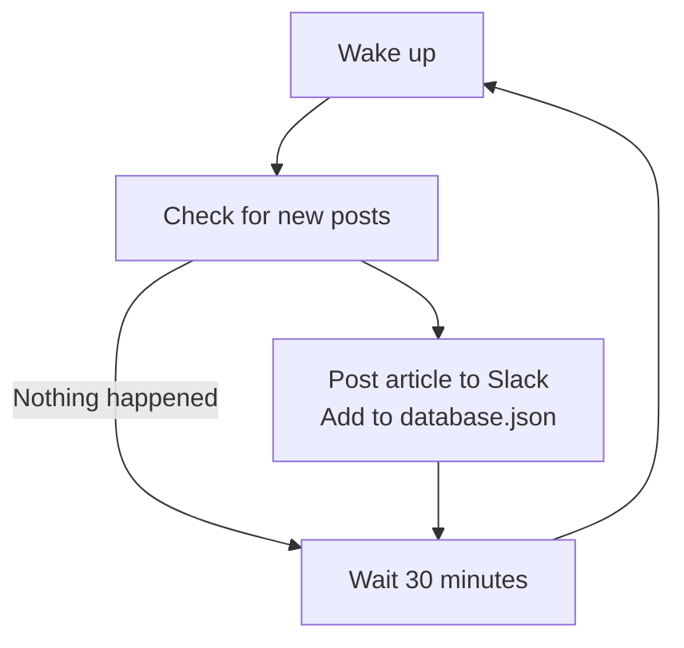

# Slacker News RSS

Small program to send webhooks to [#slacker-news](https://hackclub.enterprise.slack.com/archives/C0ALDCF90K1) when a new post comes out

## How it work

<!-- fancy ass diagram that took too long for what it's worth -->


## Installation

### docker-compose.yml

```yaml
services:
  slacker-news-rss:
    build: .
    restart: unless-stopped
    container_name: slacker-news-rss
    env_file:
      - .env
    environment:
      DATABASE_PATH: /data/database.json
      INTERVAL_SECONDS: 1800
    volumes:
      - ./data:/data
```

### Environment variable

```toml
RSS_FEED="https://news.hackclub.com/feed.xml"
SLACK_WEBHOOK="https://hooks.slack.com/services/_________/___________/________________________"
```
