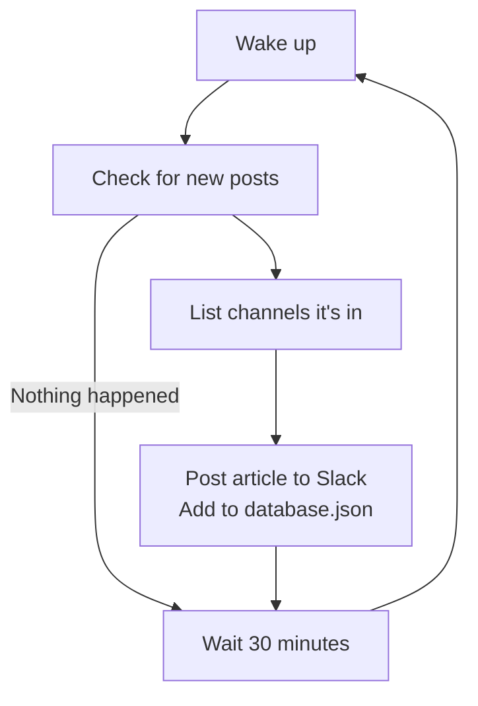

# Slacker News RSS

Small program to send to Slack channels when a new [HackClub News](https://news.hackclub.com) post comes out

## How it work

<!-- fancy ass diagram that took too long for what it's worth -->

```mermaid
flowchart TB
    n1["Wake up"] --> n2["Check for new posts"]
    n2 -- Nothing happened --> n3["Wait 30 minutes"]
    n3 --> n1
    n4["Post article to Slack<br>Add to database.json"] --> n3
    n2 --> n5@{ label: "List channels it's in" }
    n5 --> n4

    n1@{ shape: rect}
    n3@{ shape: rect}
    n4@{ shape: rect}
    n5@{ shape: rect}
```

## Installation

After installing the Docker compose and environment variable, make sure the bot isn't in any channels to don't bomb your channels with 10**67 messages (as the database is empty)

### docker-compose.yml

```yaml
services:
  slacker-news-rss:
    image: ghcr.io/mathiasdpx/slacker-news-rss:latest
    restart: unless-stopped
    container_name: slacker-news-rss
    env_file:
      - .env
    environment:
      DATABASE_PATH: /data/database.json
      INTERVAL_SECONDS: 1800
    volumes:
      - ./data:/data
```

### Environment variable

```toml
RSS_TOKEN="_____"
SLACK_BOT_TOKEN="xoxb-_____"
SLACK_APP_TOKEN="xapp-_____"
ADMINS="U__________,U__________"
```

`RSS_TOKEN` is a private feed key from [news.hackclub.com/rss](https://news.hackclub.com/rss/). The bot reads `feed.xml?include=protected&token=<RSS_TOKEN>`: every article, protected ones included, and no Slack columns such as YSWS. `RSS_FEED` optionally points at another feed.xml, like a staging site.

`ADMINS` is user ids of peoples allowed to delete Slacker News messages with the "Delete message" shortcut, separated with commas


## Development

You can restrict channels with the `SLACK_CHANNELS` env variable. You can have multiple channels by adding a commas between ids